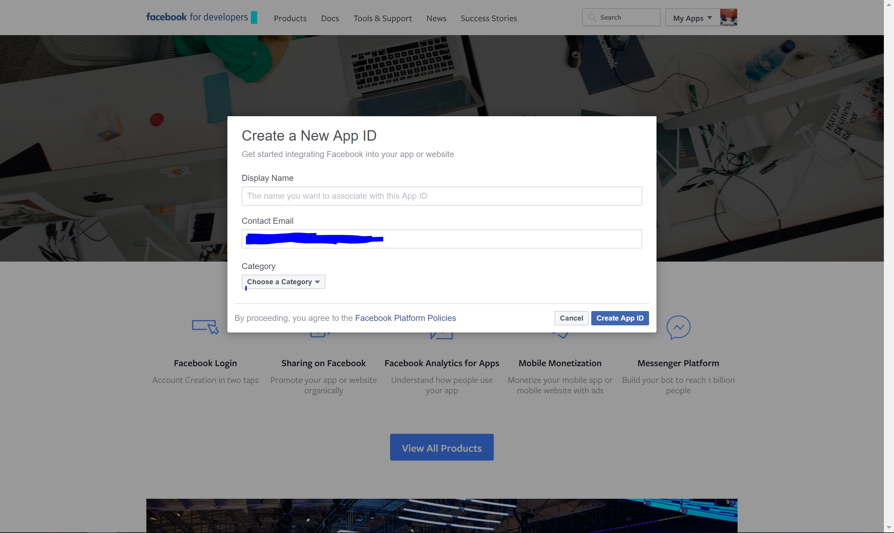
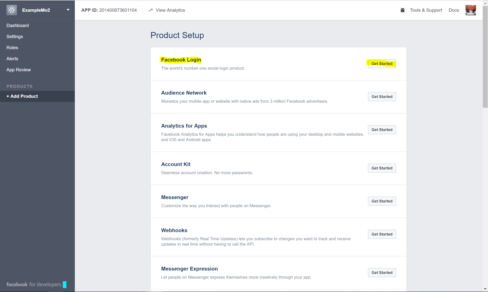

# Facebook Authentication

## 1. Creating an App in Facebook

* Navigate to `https://developers.facebook.com/`.
* Click 'My Apps' in the top right corner of your screen.


* From the dropdown list select 'Add a New App'.



* Give your app a display name.
* Enter your contact email address.
* For 'Category', select 'Health & Fitness'.
* When you're ready, click 'Create App ID'.
* Once created, you should be taken to the 'Product Setup' page. You should see a section called 'Facebook login'.
* Click 'Get Started'.



* Under 'Valid OAuth redirect URIs', add the URL to your Azure Mobile App.
* Make sure your URL follows with ```/.auth/login/facebook/callback```. So for example, your redirect URI would be ```https://YOUR-WEBSITE.azurewebsites.net/.auth/login/facebook/callback```
* In the left-hand navigation, click Settings. On the App Secret field, click Show, provide your password if requested, then make a note of the values of App ID and App Secret. You use these later to configure your application in Azure.
* The Facebook account which was used to register the application is an administrator of the app. At this point, only administrators can sign into this application. To authenticate other Facebook accounts, click App Review and enable Make public to enable general public access using Facebook authentication.

## 2. Add Facebook information to your azure mobile app

* Back in the Azure portal, navigate to your application. Click Settings > Authentication / Authorization, and make sure that App Service Authentication is On.
* Click Facebook, paste in the App ID and App Secret values which you obtained previously, for scopes, select 'email', then click OK.


By default, App Service provides authentication but does not restrict authorized access to your site content and APIs. You must authorize users in your app code.

* When done configuring authentication, click Save.

## 3. Update your mobile app to authenticate users

We'll assume you already have the ```Microsoft.Azure.Mobile.Client``` NuGet packages installed.

* In Visual Studio or Xamarin Studio, open App.cs from the project with Portable in the name, which is Portable Class Library project, then add the following ```using``` statement:

```
using System.Threading.Tasks;
```

* In App.cs, add the following ```IAuthenticate``` interface definition immediately before the ```App``` class definition.

```
 public interface IAuthenticate
 {
     Task<bool> Authenticate();
 }
 ```

 * To initialize the interface with a platform-specific implementation, add the following static members to the App class.

 ```
 public static IAuthenticate Authenticator { get; private set; }

 public static void Init(IAuthenticate authenticator)
 {
     Authenticator = authenticator;
 }
 ```

 * Open HomePage.xaml from the Portable Class Library project, add the following Button element in the stackLayout element, after the existing button:

 ```
 <Button x:Name="loginButton" Text="Sign-in" MinimumHeightRequest="30"
     Clicked="loginButton_Clicked"/>
```

This button triggers server-managed authentication with your mobile app backend.

* Open HomePage.xaml.cs from the Portable Class Library project, then add the following field to the ```HomePage``` class:

```
// Track whether the user has authenticated.
 bool authenticated = false;
 ```

 * Replace the OnAppearing method with the following code:

 ```
  protected override async void OnAppearing()
 {
     base.OnAppearing();

     if (authenticated == true)
     {
         // Hide the Sign-in button.
         this.loginButton.IsVisible = false;
     }
 }
 ```

 This code makes sure that data is only refreshed from the service after you have been authenticated.

 * Add the following handler for the Clicked event to the ```HomePage``` class:

 ```
 async void loginButton_Clicked(object sender, EventArgs e)
 {
     if (App.Authenticator != null)
         authenticated = await App.Authenticator.Authenticate();

     if (authenticated == true)
         this.loginButton.IsVisible = false;
 }
 ```

 * Save your changes and rebuild the Portable Class Library project verifying no errors.

 ## 4. Add authentication to the Android app

 * In Visual Studio or Xamarin Studio, right-click the droid project, then Set as StartUp Project.
 * Press F5 to start the project in the debugger, then verify that an unhandled exception with a status code of 401 (Unauthorized) is raised after the app starts. The 401 code is produced because access on the backend is restricted to authorized users only.
 * Open MainActivity.cs in the Android project and add the following ```using``` statements:

 ```
 using Microsoft.WindowsAzure.MobileServices;
 using System.Threading.Tasks;
 ```

 * Update the MainActivity class to implement the IAuthenticate interface, as follows:

 ```
 public class MainActivity : global::Xamarin.Forms.Platform.Android.FormsApplicationActivity, IAuthenticate
 ```

 * Update the MainActivity class by adding a MobileServiceUser field and an Authenticate method, which is required by the IAuthenticate interface, as follows:

 ```
 // Define a authenticated user.
 private MobileServiceUser user;

 public async Task<bool> Authenticate()
 {
     var success = false;
     var message = string.Empty;
     try
     {
         // Sign in with Facebook login using a server-managed flow.
         user = await TodoItemManager.DefaultManager.CurrentClient.LoginAsync(this,
             MobileServiceAuthenticationProvider.Facebook);
         if (user != null)
         {
             message = string.Format("you are now signed-in as {0}.",
                 user.UserId);
             success = true;
         }
     }
     catch (Exception ex)
     {
         message = ex.Message;
     }

     // Display the success or failure message.
     AlertDialog.Builder builder = new AlertDialog.Builder(this);
     builder.SetMessage(message);
     builder.SetTitle("Sign-in result");
     builder.Create().Show();

     return success;
 }
 ```

 * Add the following code to the OnCreate method of the MainActivity class before the call to ```LoadApplication()```:

 ```
 // Initialize the authenticator before loading the app.
 App.Init((IAuthenticate)this);
 ```

 This code ensures the authenticator is initialized before the app loads.

 * Rebuild the app, run it, then sign in with the authentication provider you chose and verify you are able to access data as an authenticated user.

 ## 5. Add authentication to the iOS app

* In Visual Studio or Xamarin Studio, right-click the iOS project, then Set as StartUp Project.
* Press F5 to start the project in the debugger, then verify that an unhandled exception with a status code of 401 (Unauthorized) is raised after the app starts. The 401 response is produced because access on the backend is restricted to authorized users only.
* Open AppDelegate.cs in the iOS project and add the following ```using``` statements:

```
using Microsoft.WindowsAzure.MobileServices;
using System.Threading.Tasks;
 ```

 * Update the AppDelegate class to implement the IAuthenticate interface, as follows:

 ```
 public partial class AppDelegate : global::Xamarin.Forms.Platform.iOS.FormsApplicationDelegate, IAuthenticate
 ```

 * Update the AppDelegate class by adding a MobileServiceUser field and an Authenticate method, which is required by the IAuthenticate interface, as follows:

 ```
 // Define a authenticated user.
 private MobileServiceUser user;

 public async Task<bool> Authenticate()
 {
     var success = false;
     var message = string.Empty;
     try
     {
         // Sign in with Facebook login using a server-managed flow.
         if (user == null)
         {
             user = await TodoItemManager.DefaultManager.CurrentClient
                 .LoginAsync(UIApplication.SharedApplication.KeyWindow.RootViewController,
                 MobileServiceAuthenticationProvider.Facebook);
             if (user != null)
             {
                 message = string.Format("You are now signed-in as {0}.", user.UserId);
                 success = true;
             }
         }
     }
     catch (Exception ex)
     {
        message = ex.Message;
     }

     // Display the success or failure message.
     UIAlertView avAlert = new UIAlertView("Sign-in result", message, null, "OK", null);
     avAlert.Show();

     return success;
 }
 ```

 * Add the following line of code to the FinishedLaunching method before the call to ```LoadApplication()```:

 ```
 App.Init(this);
 ```

This code ensures the authenticator is initialized before the app is loaded.

* Rebuild the app, run it, then sign in with the authentication provider you chose and verify you are able to access data as an authenticated user.